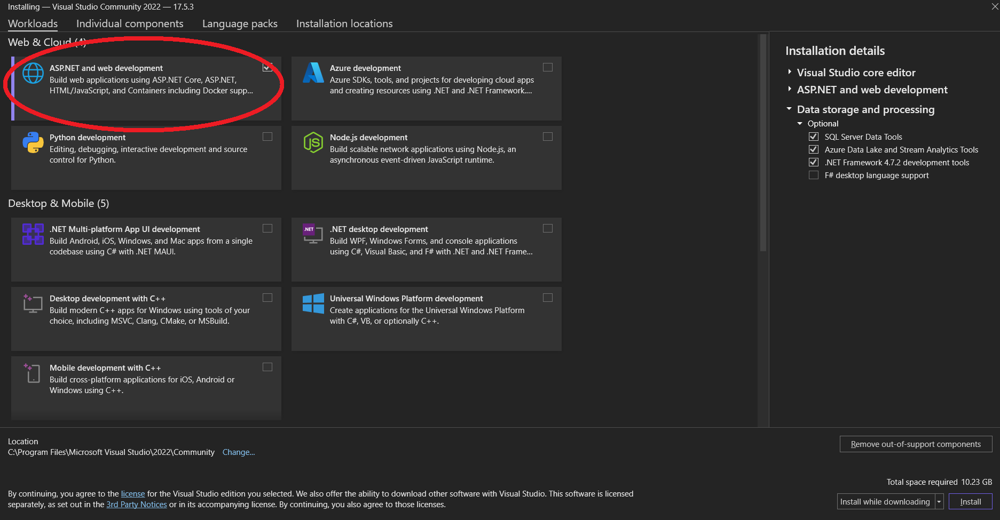
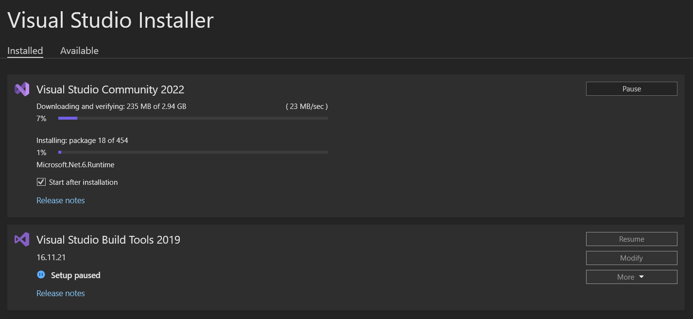
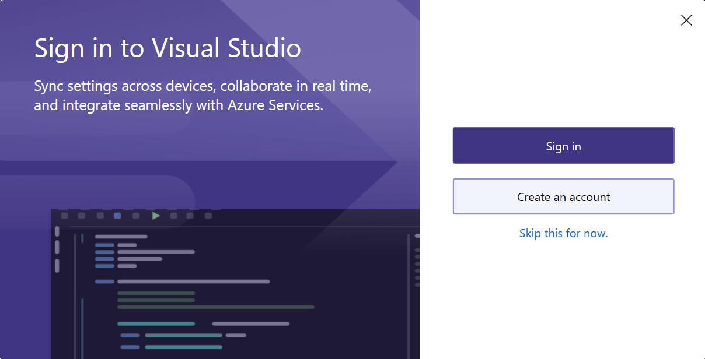
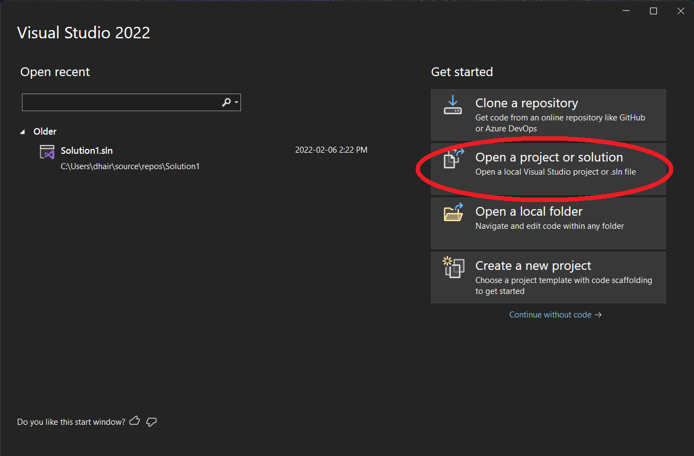
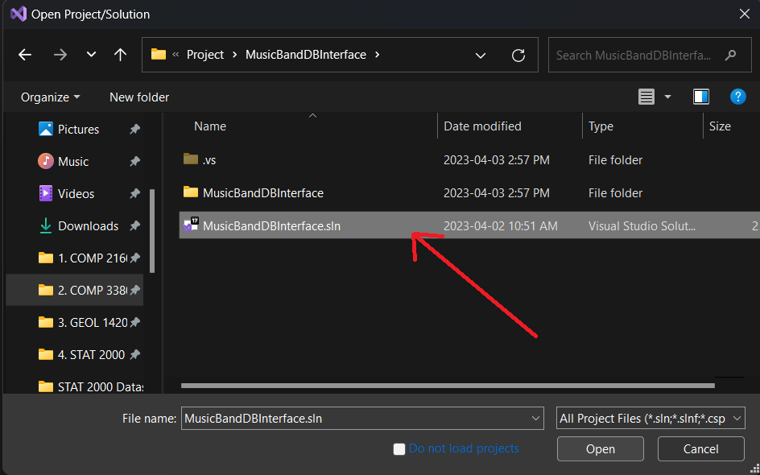
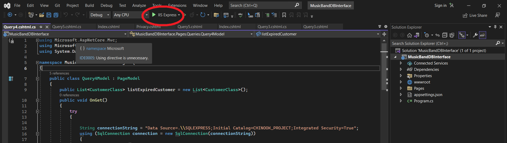
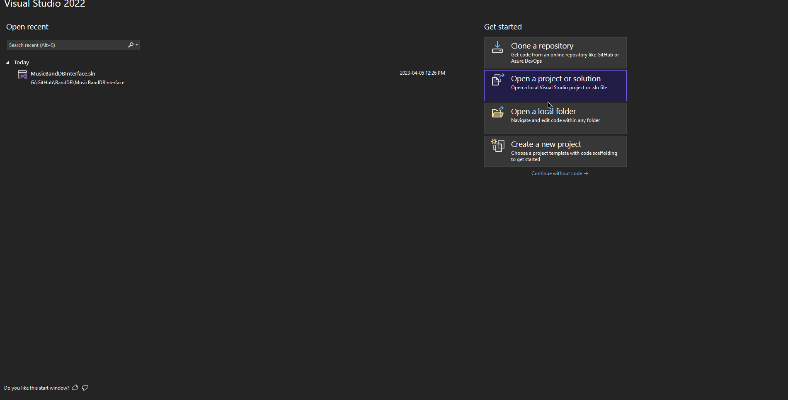

# **Music Band Database**


## Title: **How to access the front-end of the Music Band Database**


****
## **Introduction**

This project consist of a database called PROJECT, which contains information about various tables such as employees who work in the company called Chinook, where they help customers who are purchasing audio and video track of various artists. The database also includes tables that contain information about customer's invoices, artist's albums, and media type, playlist, and genre of a track 

****
## **Source:** 
The data used in this project (Chinook Dataset) was obtained from [Source Name](https://relational.fit.cvut.cz/dataset/Financial), a publicly available database available directly from MariaDB database. Which can be access using the following credentials (MySQL Workbench):
```
hostname: relational.fit.cvut.cz
port: 3306
username: guest
password: relational
```
****
## **Purpose**

The basic purpose of this Readme file is to list the practical steps of how to run the front-end of the Music Band Database.
****
## Prerequisites
To build and run this project successfully, you need to have Visual Studio installed in your system. If you don't have Visual Studio installed, a Community 2022 version has been attached in this folder. Steps to how to install the Visual Studio are given below. Secondly, you need to have Microsoft SQL Server installed and it has to be connected to the Server from your local machine using following credentials.

```
Server type: Database Engine
Server name: .\SQLEXPRESS
Authentication: Windows Authentication
```
And then press Connect

**Note** : It has to be connected using Windows Authentication and not the SQL server authentication.

****

## Instructions

### **1. Create Database**

In your local machine create a new database called PROJECT using the following command:

```
CREATE DATABASE PROJECT
```
__You can also create the database manually__

- Once the database has been created successfully, open the file name called PROJECT.sql available inside the provided folder. PROJECT.sql is a SQL file which contains queries to create the required tables and also queries to populate above mentioned PROJECT database. You can choose to open this file with Notepad or SQL Server. Afer opening the file, copy all the queries and paste them in the SQL Server and execute them.This will create and populate the database.

### **2. Install the Visual Studio**

**Note** : You can choose to skip this step if you already have latest version of Visual Studio installed. __Visual Studio is not same as Visual Studio Code.__

Follow the following steps to install the Visual studio.

- Click on the setup provided in the folder.

- Select the ASP.NET and web development and install it as shown in the image below. For the sake of this project, we only need web development components. 



****

- After selecting install you will see the following window. When the installation is finish select Lauch.


****


- In the next step, you can either choose to sign up or skip sign up



### **4. Run the project**

1. Copy the folder named MusicBandDBInterface and save it to your system.
2. Once Visual Studio has been installed, you will see a window like this. And we want to Select the second option "Open a project or solution". 



3. Now select the path where you pasted the MusicBandDBInterface and open that folder.
4. You will see two files there as shown in the image below. Select the file with extension .sln i.e. MusicBandDBInterface.sln file.



5. Once the file has been open, you will see a button on the top of the screen labelled "IIS EXxpress". After clicking that option webpage will open.

 

 ### **5. Operating the front End.**

 Below is the Visual demonstration of "How to operate the front-end webpage."

  
